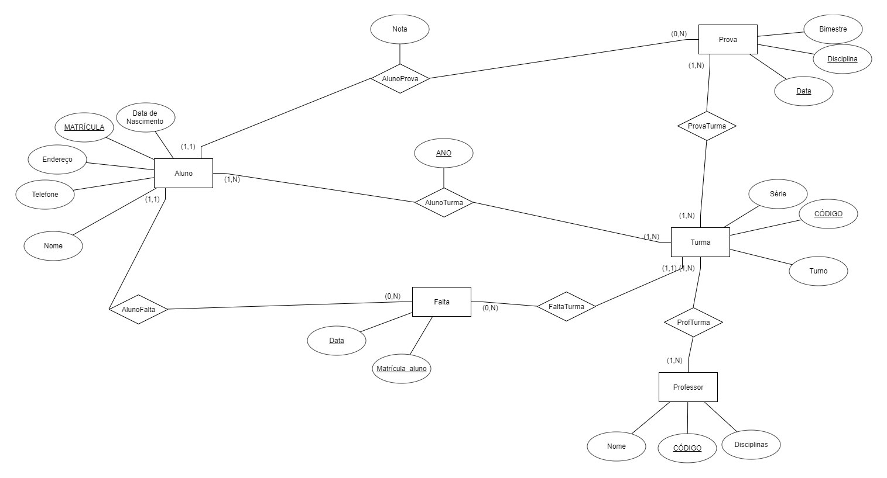
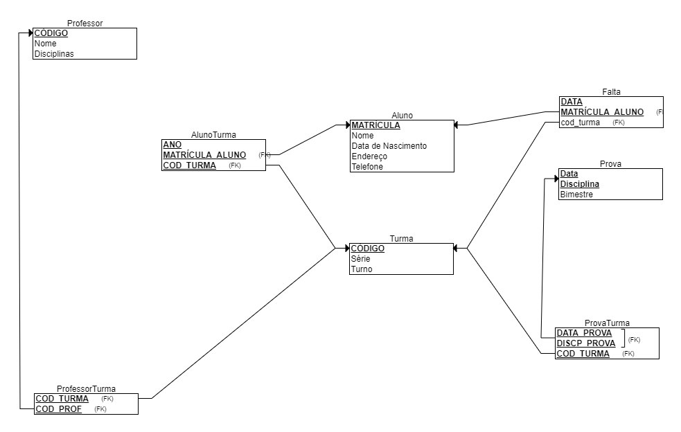

# Editando e Populando o BD

Para que o projeto seja testado, precisaremos de um banco de
dados populado. Por isso, construímos um banco de dados fictício
para o nosso projeto.  

### Modelo Entidade-Relacionamento do BD:


### Tabela de Relação:


### Script para Criar o Banco:
```sql
#Script para resetar o banco com tabelas e dados ficticios iniciais

#Deleta, cria e seleciona BD

DROP DATABASE IF EXISTS FMF;
CREATE DATABASE FMF;
USE FMF;

#Cria tabelas

CREATE TABLE Turma (
	Codigo VARCHAR(20) NOT NULL,
    Serie INT NOT NULL,
    Turno VARCHAR(20) NOT NULL,
    PRIMARY KEY (Codigo)
);

CREATE TABLE Professor (
	Codigo VARCHAR(20) NOT NULL,
    Nome VARCHAR(50) NOT NULL,
    Disciplina VARCHAR(25) NOT NULL,
    PRIMARY KEY (Codigo)
);

CREATE TABLE ProfessorTurma (
	Cod_Turma VARCHAR(20) NOT NULL,
    Cod_Prof VARCHAR(20) NOT NULL,
    CONSTRAINT PK_ProfessorTurma PRIMARY KEY (Cod_Turma, Cod_Prof),
    FOREIGN KEY (Cod_Turma) REFERENCES Turma (Codigo),
    FOREIGN KEY (Cod_Prof) REFERENCES Professor (Codigo)
);

CREATE TABLE Aluno (
	Matricula VARCHAR(20) NOT NULL,
    Nome VARCHAR(50) NOT NULL,
    Data_Nascimento DATE NOT NULL,
    Endereco VARCHAR(100) NOT NULL,
    Telefone VARCHAR(15) NOT NULL,
    PRIMARY KEY (Matricula)
);

CREATE TABLE AlunoTurma (
	Ano YEAR NOT NULL,
    Matricula_Aluno VARCHAR(20) NOT NULL,
    Cod_Turma VARCHAR(20) NOT NULL,
    CONSTRAINT PK_AlunoTurma PRIMARY KEY (Ano, Matricula_Aluno, Cod_Turma),
    FOREIGN KEY (Matricula_Aluno) REFERENCES Aluno (Matricula),
    FOREIGN KEY (Cod_Turma) REFERENCES Turma (Codigo)
);

CREATE TABLE Falta (
	Data_Falta DATE NOT NULL,
    Matricula_Aluno VARCHAR(20) NOT NULL,
    Cod_Turma VARCHAR(20) NOT NULL,
    CONSTRAINT PK_Falta PRIMARY KEY (Data_Falta, Matricula_Aluno),
    FOREIGN KEY (Matricula_Aluno) REFERENCES Aluno (Matricula),
    FOREIGN KEY (Cod_Turma) REFERENCES Turma (Codigo)
);

CREATE TABLE Prova (
	Data_Prova DATE NOT NULL,
    Disciplina VARCHAR(25) NOT NULL,
    Bimestre INT NOT NULL,
    CONSTRAINT PK_Prova PRIMARY KEY (Data_Prova, Disciplina)
);

CREATE TABLE ProvaTurma (
	Data_Prova DATE NOT NULL,
    Disciplina_Prova VARCHAR(25) NOT NULL,
    Cod_Turma VARCHAR(20) NOT NULL,
    CONSTRAINT PK_ProvaTurma PRIMARY KEY (Data_Prova, Disciplina_Prova, Cod_Turma),
	FOREIGN KEY (Data_Prova, Disciplina_Prova) REFERENCES Prova (Data_Prova, Disciplina),
    FOREIGN KEY (Cod_Turma) REFERENCES Turma (Codigo)
);

#Popula BD com dados ficticios

#Aluno (Matricula, Nome, Nascimento, Endereço, Telefone)
INSERT INTO Aluno VALUES ('5542', 'Rafael Cardoso', '2001/02/28', 'Rua Adelino Cândido de Oliveira, 67, Olaria, Rio de Janeiro', '50016136');
INSERT INTO Aluno VALUES ('5566', 'Rafael Martins', '2000/11/12', 'Rua Amadeu Rocha, 102, Penha, Rio de Janeiro', '24027621');
INSERT INTO Aluno VALUES ('5567', 'Isaias Cardoso', '2000/03/10', 'Rua Dona Isabel, 99, Bonsucesso, Rio de Janeiro', '24790698');
INSERT INTO Aluno VALUES ('5546', 'João Victor', '2000/02/25', 'Rua da Proclamação, 15, Bonsucesso, Rio de Janeiro', '29155766');
INSERT INTO Aluno VALUES ('5561', 'Sandra Torres', '2001/11/11', 'Rua Manoel Canejo, 56, Olaria, Rio de Janeiro', '24387836');
INSERT INTO Aluno VALUES ('5556', 'Ricardo Oliveira', '1999/01/31', 'Rua Irene, 105, Ramos, Rio de Janeiro', '56246092');
INSERT INTO Aluno VALUES ('5555', 'André Cintra', '1999/02/23', 'Rua Padre Domingos Carneiro, 211, Olaria, Rio de Janeiro', '26675120');
INSERT INTO Aluno VALUES ('5574', 'Sula Guimarães', '2000/09/30', 'Rua João Santana, 40, Ramos, Rio de Janeiro', '27023440');
INSERT INTO Aluno VALUES ('5554', 'Arnaldo Pereira', '1999/03/07', 'Rua Afonso Ribeiro, 23, Penha, Rio de Janeiro', '21207703');
INSERT INTO Aluno VALUES ('5562', 'Débora Andrade', '2001/10/26', 'Rua da Liberdade, 42, Bonsucesso, Rio de Janeiro', '59721201');
INSERT INTO Aluno VALUES ('5563', 'Carolina Pereira', '2000/07/23', 'Rua Barros Barreto, 50, Bonsucesso, Rio de Janeiro', '31209769');
INSERT INTO Aluno VALUES ('5549', 'José Ferreira', '2000/07/14', 'Professor Honório Silvestre, 20, Ramos, Rio de Janeiro', '25918963');
INSERT INTO Aluno VALUES ('5548', 'Adriane Miranda', '1999/12/15', 'Rua Adelino Cândido de Oliveira, 42, Olaria, Rio de Janeiro', '23123167');
INSERT INTO Aluno VALUES ('5569', 'Augusto Gouveia', '1999/11/22', 'Rua Doroteia, 62, Ramos, Rio de Janeiro', '35740955');
INSERT INTO Aluno VALUES ('5571', 'Sheila Abreu', '2000/06/29', 'Rua Doutor Luís Gaudie Ley, 145, Penha, Rio de Janeiro', '58773086');
INSERT INTO Aluno VALUES ('5570', 'Francisco Junior', '2000/08/01', 'Rua Antônio de Lemos, 11, Olaria, Rio de Janeiro', '23240949');
INSERT INTO Aluno VALUES ('5572', 'Marcelo Cesar', '1999/02/26', 'Rua Luis Camara, 21, Ramos, Rio de Janeiro', '49713049');
INSERT INTO Aluno VALUES ('5573', 'Cláudio Ferreira', '2000/05/03', 'Rua Baltimore, 39, Ramos, Rio de Janeiro', '50766717');
INSERT INTO Aluno VALUES ('5547', 'Francisco Gonzaga', '2001/05/17', 'Rua Vieira Ferreira, 87, Bonsucesso, Rio de Janeiro', '52985303');
INSERT INTO Aluno VALUES ('5552', 'Eulália Arruda', '2000/02/19', 'Rua Soldado Paiva, 99, Penha, Rio de Janeiro', '48999351');
INSERT INTO Aluno VALUES ('5553', 'Roberto Chibana', '2000/09/20', 'Rua Doutor Nunes, 74, Olaria, Rio de Janeiro', '39679698');
INSERT INTO Aluno VALUES ('5544', 'Douglas Lima', '1999/11/21', 'Rua Alvaro Antônio Sauka, 77, Olaria, Rio de Janeiro', '51887809');
INSERT INTO Aluno VALUES ('5545', 'Carlyson Trindade', '1999/07/02', 'Rua Felizardo Fontes, 81, Ramos, Rio de Janeiro', '52987554');
INSERT INTO Aluno VALUES ('5560', 'Thika Freitas', '2001/03/05', 'Rua Manoel Canejo, 19, Olaria, Rio de Janeiro', '23070116');
INSERT INTO Aluno VALUES ('5576', 'Gabriel Magalhães', '2000/02/20', 'Rua Costa Rica, 43, Penha, Rio de Janeiro', '56227852');

#Turma (Codigo, Serie, Turno)
INSERT INTO Turma VALUES ('2A', 2, 'Matutino');
INSERT INTO Turma VALUES ('3A', 3, 'Matutino');
INSERT INTO Turma VALUES ('2B', 2, 'Vespertino');
INSERT INTO Turma VALUES ('3B', 3, 'Vespertino');

#Professor (Codigo, Nome, Disciplina)
INSERT INTO Professor VALUES ('53', 'João Cléber', 'Matemática II');
INSERT INTO Professor VALUES ('47', 'Raquel Silva', 'Inglês II');
INSERT INTO Professor VALUES ('39', 'Ricardo Tristão', 'Inglês III');
INSERT INTO Professor VALUES ('52', 'Cláudio Martins', 'Matemática III');
INSERT INTO Professor VALUES ('50', 'Mariane Miranda', 'Matemática III');

#ProfessorTurma (Cod_Turma, Cod_Prof)
INSERT INTO ProfessorTurma VALUES ('2A', '53');
INSERT INTO ProfessorTurma VALUES ('2B', '53');
INSERT INTO ProfessorTurma VALUES ('2A', '47');
INSERT INTO ProfessorTurma VALUES ('2B', '47');
INSERT INTO ProfessorTurma VALUES ('3A', '39');
INSERT INTO ProfessorTurma VALUES ('3B', '39');
INSERT INTO ProfessorTurma VALUES ('3A', '52');
INSERT INTO ProfessorTurma VALUES ('3B', '50');

#AlunoTurma (Ano, Matricula_Aluno, Cod_Turma)
INSERT INTO AlunoTurma VALUES ('2018', '5542', '3A');
INSERT INTO AlunoTurma VALUES ('2018', '5566', '3A');
INSERT INTO AlunoTurma VALUES ('2018', '5567', '3A');
INSERT INTO AlunoTurma VALUES ('2018', '5546', '3A');
INSERT INTO AlunoTurma VALUES ('2017', '5542', '3B');
INSERT INTO AlunoTurma VALUES ('2017', '5566', '2A');
INSERT INTO AlunoTurma VALUES ('2017', '5567', '3A');
INSERT INTO AlunoTurma VALUES ('2017', '5546', '2B');
INSERT INTO AlunoTurma VALUES ('2016', '5542', '2A');
INSERT INTO AlunoTurma VALUES ('2016', '5567', '2B');
INSERT INTO AlunoTurma VALUES ('2018', '5561', '3B');
INSERT INTO AlunoTurma VALUES ('2018', '5556', '3B');
INSERT INTO AlunoTurma VALUES ('2018', '5555', '3B');
INSERT INTO AlunoTurma VALUES ('2018', '5574', '3B');
INSERT INTO AlunoTurma VALUES ('2018', '5554', '3B');
INSERT INTO AlunoTurma VALUES ('2017', '5561', '2A');
INSERT INTO AlunoTurma VALUES ('2017', '5556', '2A');
INSERT INTO AlunoTurma VALUES ('2017', '5555', '2B');
INSERT INTO AlunoTurma VALUES ('2017', '5574', '3A');
INSERT INTO AlunoTurma VALUES ('2017', '5554', '2B');
INSERT INTO AlunoTurma VALUES ('2016', '5561', '2A');
INSERT INTO AlunoTurma VALUES ('2016', '5556', '2B');
INSERT INTO AlunoTurma VALUES ('2018', '5562', '2A');
INSERT INTO AlunoTurma VALUES ('2018', '5563', '2A');
INSERT INTO AlunoTurma VALUES ('2018', '5549', '2A');
INSERT INTO AlunoTurma VALUES ('2018', '5548', '2A');
INSERT INTO AlunoTurma VALUES ('2018', '5569', '2A');
INSERT INTO AlunoTurma VALUES ('2018', '5571', '2A');
INSERT INTO AlunoTurma VALUES ('2018', '5570', '2A');
INSERT INTO AlunoTurma VALUES ('2017', '5563', '2A');
INSERT INTO AlunoTurma VALUES ('2018', '5572', '2B');
INSERT INTO AlunoTurma VALUES ('2018', '5573', '2B');
INSERT INTO AlunoTurma VALUES ('2018', '5547', '2B');
INSERT INTO AlunoTurma VALUES ('2018', '5552', '2B');
INSERT INTO AlunoTurma VALUES ('2018', '5553', '2B');
INSERT INTO AlunoTurma VALUES ('2018', '5544', '2B');
INSERT INTO AlunoTurma VALUES ('2018', '5545', '2B');
INSERT INTO AlunoTurma VALUES ('2018', '5560', '2B');
INSERT INTO AlunoTurma VALUES ('2018', '5576', '2B');
INSERT INTO AlunoTurma VALUES ('2017', '5553', '2B');
INSERT INTO AlunoTurma VALUES ('2017', '5544', '2A');

#Falta (Data_Falta, Matricula_Aluno, Cod_Turma)
INSERT INTO Falta VALUES ('2018/02/10', '5552', '2B');
INSERT INTO Falta VALUES ('2018/02/15', '5547', '2B');
INSERT INTO Falta VALUES ('2018/03/01', '5561', '3B');
INSERT INTO Falta VALUES ('2018/01/31', '5542', '3A');
INSERT INTO Falta VALUES ('2018/01/31', '5576', '2B');
INSERT INTO Falta VALUES ('2018/03/17', '5546', '3A');
INSERT INTO Falta VALUES ('2018/03/20', '5546', '3A');
INSERT INTO Falta VALUES ('2018/04/10', '5561', '3B');
INSERT INTO Falta VALUES ('2018/04/25', '5547', '2B');
INSERT INTO Falta VALUES ('2018/01/05', '5562', '2A');
INSERT INTO Falta VALUES ('2018/02/01', '5569', '2A');

#Prova (Data_Prova, Disciplina, Bimestre)
INSERT INTO Prova VALUES ('2018/04/10', 'Matemática II', 1);
INSERT INTO Prova VALUES ('2018/06/13', 'Matemática II', 2);
INSERT INTO Prova VALUES ('2018/08/05', 'Matemática II', 3);
INSERT INTO Prova VALUES ('2018/10/20', 'Matemática II', 4);
INSERT INTO Prova VALUES ('2018/04/12', 'Inglês II', 1);
INSERT INTO Prova VALUES ('2018/06/15', 'Inglês II', 2);
INSERT INTO Prova VALUES ('2018/08/07', 'Inglês II', 3);
INSERT INTO Prova VALUES ('2018/10/22', 'Inglês II', 4);
INSERT INTO Prova VALUES ('2018/04/15', 'Matemática III', 1);
INSERT INTO Prova VALUES ('2018/06/20', 'Matemática III', 2);
INSERT INTO Prova VALUES ('2018/08/05', 'Matemática III', 3);
INSERT INTO Prova VALUES ('2018/10/18', 'Matemática III', 4);
INSERT INTO Prova VALUES ('2018/04/10', 'Inglês III', 1);
INSERT INTO Prova VALUES ('2018/06/10', 'Inglês III', 2);
INSERT INTO Prova VALUES ('2018/08/05', 'Inglês III', 3);
INSERT INTO Prova VALUES ('2018/10/22', 'Inglês III', 4);

#ProvaTurma (Data_Prova, Disciplina_Prova, Cod_Turma)
INSERT INTO ProvaTurma VALUES ('2018/04/10', 'Matemática II', '2A');
INSERT INTO ProvaTurma VALUES ('2018/04/10', 'Matemática II', '2B');
INSERT INTO ProvaTurma VALUES ('2018/06/13', 'Matemática II', '2A');
INSERT INTO ProvaTurma VALUES ('2018/06/13', 'Matemática II', '2B');
INSERT INTO ProvaTurma VALUES ('2018/08/05', 'Matemática II', '2A');
INSERT INTO ProvaTurma VALUES ('2018/08/05', 'Matemática II', '2B');
INSERT INTO ProvaTurma VALUES ('2018/10/20', 'Matemática II', '2A');
INSERT INTO ProvaTurma VALUES ('2018/10/20', 'Matemática II', '2B');
INSERT INTO ProvaTurma VALUES ('2018/04/12', 'Inglês II', '2A');
INSERT INTO ProvaTurma VALUES ('2018/04/12', 'Inglês II', '2B');
INSERT INTO ProvaTurma VALUES ('2018/06/15', 'Inglês II', '2A');
INSERT INTO ProvaTurma VALUES ('2018/06/15', 'Inglês II', '2B');
INSERT INTO ProvaTurma VALUES ('2018/08/07', 'Inglês II', '2A');
INSERT INTO ProvaTurma VALUES ('2018/08/07', 'Inglês II', '2B');
INSERT INTO ProvaTurma VALUES ('2018/10/22', 'Inglês II', '2A');
INSERT INTO ProvaTurma VALUES ('2018/10/22', 'Inglês II', '2B');
INSERT INTO ProvaTurma VALUES ('2018/04/15', 'Matemática III', '3A');
INSERT INTO ProvaTurma VALUES ('2018/04/15', 'Matemática III', '3B');
INSERT INTO ProvaTurma VALUES ('2018/06/20', 'Matemática III', '3A');
INSERT INTO ProvaTurma VALUES ('2018/06/20', 'Matemática III', '3B');
INSERT INTO ProvaTurma VALUES ('2018/08/05', 'Matemática III', '3A');
INSERT INTO ProvaTurma VALUES ('2018/08/05', 'Matemática III', '3B');
INSERT INTO ProvaTurma VALUES ('2018/10/18', 'Matemática III', '3A');
INSERT INTO ProvaTurma VALUES ('2018/10/18', 'Matemática III', '3B');
INSERT INTO ProvaTurma VALUES ('2018/04/10', 'Inglês III', '3A');
INSERT INTO ProvaTurma VALUES ('2018/04/10', 'Inglês III', '3B');
INSERT INTO ProvaTurma VALUES ('2018/06/10', 'Inglês III', '3A');
INSERT INTO ProvaTurma VALUES ('2018/06/10', 'Inglês III', '3B');
INSERT INTO ProvaTurma VALUES ('2018/08/05', 'Inglês III', '3A');
INSERT INTO ProvaTurma VALUES ('2018/08/05', 'Inglês III', '3B');
INSERT INTO ProvaTurma VALUES ('2018/10/22', 'Inglês III', '3A');
INSERT INTO ProvaTurma VALUES ('2018/10/22', 'Inglês III', '3B');
```
